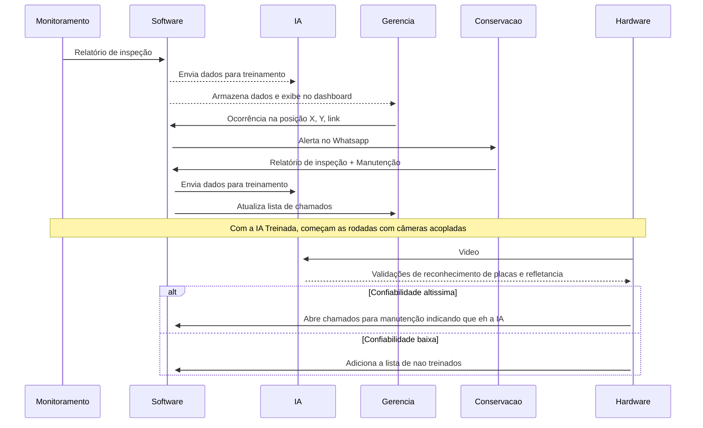

# Roadlab 

Plataforma para monitoramento e gestão da refletância de placas usando inteligência artificial.
Com esse projeto entendemos que há viabilidade para inserção de inteligência artificial e machine learning voltado para o campo de inspeção de dados retro-refletivos e segurança rodoviária.
Todo processo de armazenamento de dados está sendo feito em memória pois não há necessidade do armazemento em um banco de dados real.

## Fluxo da ideia

## ⚙️ Requirementos para funcionar

- 🐋 Docker
- 🟢 Node
- 📦 Yarn

## Tecnologias utilizadas
- Express
- Domain Driven Design
- Zod para DTOs
- Next.js
- Shadcn-ui
- Tailwindcss
- Typescript
- Turbo Repo
- Roboflow
- Figma

## 🚀 Funcionalidades atuais
Serviços (backend + frontend)
- Exibir qr-code do WhatsApp para disparo de mensagens
- Registrar time/grupo
- Listar times/grupos registrados
- Registrar relatório (inspeção/manutenção) de placas retro-refletoras
- Visualizar ocorrências
- Visualizar detalhe de ocorrência
- Enviar ocorrência para time específico

## 🚀 Como rodar o projeto

- Clone esse projeto.
- Certifique-se de que o Docker está funcionando corretamente
- Use o comando `yarn install` no terminal, isso fará com que a imagem Docker suba e as dependências sejam instaladas.
- Use o comando `yarn dev` para rodar o projeto em ambiente de desenvolvimento.

Para acessar o backend, acesse <i>http://localhost:3001</i>

Para acessar o frontend, acesse <i>http://localhost:3000/dashboard</i>

Para acessar a API integrada com whatsapp, acesse <i>http://localhost:3002</i>

## 🌱 Rotas Backend

- GET: /issues -> Retorna uma lista com todas as placas com problemas.
- POST: /issues/call/{{work_id}}/{{team_id}} -> Envia uma mensagem no WhatsApp com uma nova ocorrência.
- POST: /team/register -> Registra um time para receber os alertas.
- GET: /team/all -> Retornas os times existentes que podem receber os alertas.
- POST: /sign/{{sign_id}} -> Cadastra uma nova placa no sistema ou atualiza uma existente.

Ou

Use a collection do postman localizado `ROAD-LABS.postman_collection.json`
