# Roadlab 

Plataforma para monitoramento e gestão da refletância de placas usando inteligência artificial.
Com esse projeto entendemos que há viabilidade para inserção de inteligência artificial e machine learning voltado para o campo de inspeção de dados retro-refletivos e segurança rodoviária.
Todo processo de armazenamento de dados está sendo feito em memória pois não há necessidade do armazemento em um banco de dados real.

## Demo

## Fluxo da ideia

```mermaid
sequenceDiagram
    Monitoramento->>+Software: Relatório de inspeção
    Software-->>+IA: Envia dados para treinamento
    Software-->>+Gerencia: Armazena dados e exibe no dashboard
    Gerencia->>+Software: Ocorrência na posição X, Y, link
    Software->>+Conservacao: Alerta no Whatsapp
    Conservacao->>+Software: Relatório de inspeção + Manutenção
    Software->>+IA: Envia dados para treinamento
    Software->>+Gerencia: Atualiza lista de chamados
    Note over Monitoramento,Hardware: Com a IA Treinada, começam as rodadas com câmeras acopladas
    Hardware->>+IA: Video
    IA-->>+Hardware: Validações de reconhecimento de placas e refletancia
    alt Confiabilidade altissima
        Hardware->>Software: Abre chamados para manutenção indicando que eh a IA
    else Confiabilidade baixa
        Hardware->>Software: Adiciona a lista de nao treinados
    end
```

## ⚙️ Requirementos para funcionar

- 🐋 Docker
- 🟢 Node
- 📦 Yarn

## Tecnologias utilizadas
- Express
- Domain Driven Design
- Zod para DTOs
- Next.js
- Shadcn-ui
- Tailwindcss
- Typescript
- Turbo Repo
- Roboflow
- Figma

## 🚀 Funcionalidades atuais
Serviços (backend + frontend)
- Exibir qr-code do WhatsApp para disparo de mensagens
- Registrar time/grupo
- Listar times/grupos registrados
- Registrar relatório (inspeção/manutenção) de placas retro-refletoras
- Visualizar ocorrências
- Visualizar detalhe de ocorrência
- Enviar ocorrência para time específico

## 🚀 Como rodar o projeto

- Clone esse projeto.
- Certifique-se de que o Docker está funcionando corretamente
- Use o comando `yarn install` no terminal, isso fará com que a imagem Docker suba e as dependências sejam instaladas.
- Use o comando `yarn dev` para rodar o projeto em ambiente de desenvolvimento.

Para acessar o backend, acesse <i>http://localhost:3001</i>

Para acessar o frontend, acesse <i>http://localhost:3000/dashboard</i>

Para acessar a API integrada com whatsapp, acesse <i>http://localhost:3002</i>

## 🌱 Rotas Backend

- GET: /issues -> Retorna uma lista com todas as placas com problemas.
- POST: /issues/call/{{work_id}}/{{team_id}} -> Envia uma mensagem no WhatsApp com uma nova ocorrência.
- POST: /team/register -> Registra um time para receber os alertas.
- GET: /team/all -> Retornas os times existentes que podem receber os alertas.
- POST: /sign/{{sign_id}} -> Cadastra uma nova placa no sistema ou atualiza uma existente.

Ou

Use a collection do postman localizado `ROAD-LABS.postman_collection.json`

## Bibliografia

 - [Predicting Traffic Sign Retro Refletivity Degradation Using Deep Neutral Networks](https://www.researchgate.net/publication/356861230_Predicting_Traffic_Sign_Retro-Reflectivity_Degradation_Using_Deep_Neural_Networks)
 - [Modeling retroreflectivity degradation of traffic signs using artificial neural networks](https://www.sciencedirect.com/science/article/pii/S0386111222000462)
 - [Development of a neural network approach for the assessment of the performance of traffic sign retroreflectivity](https://repository.lsu.edu/cgi/viewcontent.cgi?article=1439&context=gradschool_theses)
- [Desenvolvimento de uma base de imagens de placas de sinalização de trânsito para sistemas de reconhecimento automático](https://wiki.sj.ifsc.edu.br/index.php/Projeto_-_Desenvolvimento_de_uma_base_de_imagens_de_placas_de_sinaliza%C3%A7%C3%A3o)

## Autores

- Alyson Vilela - [@alysonvilela](https://www.github.com/alysonvilela)
- Guilherme Vieira - [@gitlherme](https://www.github.com/gitlherme)
- Vinicius Vilela - [@vinivma](https://www.github.com/vinivma)
